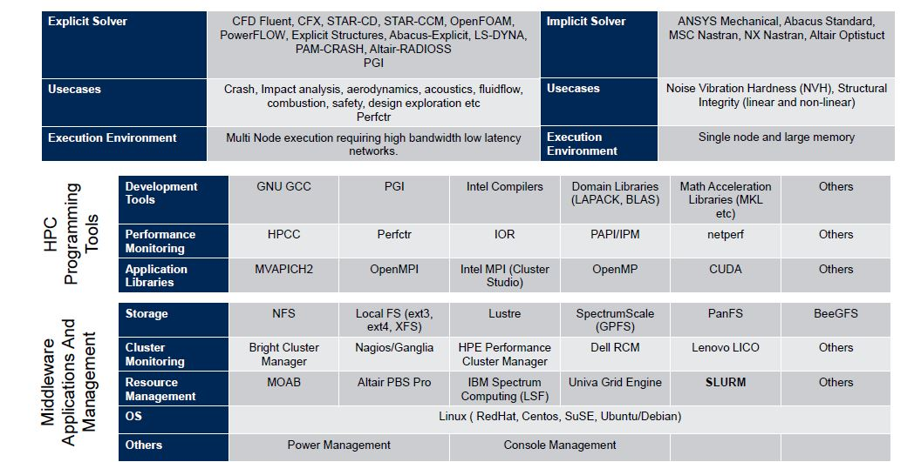

Anteckningar från arbetsmöte
============================

Anteckningar från arbetsmöte i NGP-gruppen genomfört över Zoom 

Datum: 2020-05-08 15:00-16:00

Deltagare
---------

Närvarande:\

- Vilma Canfjorden
- Henrik Eriksson
- Tomas Snäckerström
- Tobias Strid
- Erik Sundvall
- Isak Sylvin
- Jens Werling

Frånvarande:\

 - Per Sikora

Agenda
------

Ingen agenda hade skickats ut i förväg så vid sittande möte beslutades följande punkter att tas upp.

- Rekapitulering av förra mötet
- Avrapportering utfört arbete
	+ Nyckelhantering
	+ Verifikation av script för överföring av data
	+ Källor till data för pilot
	+ Teknikplattform för infrastruktur
- Till nästa möte

Anteckningar
------------

**Rekapitulering**\
Det noterades att det saknades anteckningar från senaste mötet varvid vi gemensamt rekapitulerade vad vi mindes. 

Det mötet hölls 2020-04-24 och den gemensamma bilden var att följande avhandlades på mötet:\
På ett allmänt uttryckt önskemål från Tomas gjorde Per en ansats till att förklara vilka grupper som fanns i GMS projektet och vilka områden de ansvarar för samt att förklara syftet med den grupp vi arbetar i (NGP) i relation till dessa. Taget från minnet så finns en avsiktsförklaring där VGR åtagit sig att tillhandahålla en miljö för piloten och som ska användas för att visa vilken typ av funktioner som kan byggas i en gemensam infrastruktur. NGP gruppen är tillsatt för att få en operativ grupp från projektets olika arbetsgrupper och som förhoppningsvis kan arbeta mer koncenterat med konkreta uppifter.

Vidare diskuterades arbetet framgent och den påverkan som rådande situation kring hantering av covid-19 har för projektet. Erik meddelade att han blivit ålagd uppgifter av regionen och därmed kommer att behöva prioritera ner arbetet i GMS-Skalbara Informatiklösningar temporärt. Även Per uttryckte att han behöver omprioritera till följd av behov i regionen. Övriga gruppen rapporterade att de är förhållandevis opåverkade av frågan i sina respektive regioner. Per uttryckte en önskan om att denna grupp i ett bästa scenario kunde arbeta mer självständigt. Tomas påpekade att det bara kan ske så långt det finns definierade och konkreta uppgifter att lösa.

Med det i åtanke diskuterades ett antal områden för att utröna arbetsuppgifter som var redo för att arbetas med. Dessa presenteras under avrapportering.

**Avrapportering**\
De som hade uppgifter som de arbetat med sedan förra mötet avrapporterade status i det arbetet.

***Nyckelhantering***\
Vid möte den 24:e uttryckte Per frågna kring hur vi skulle utbyta nycklar mellan miljöer. Tomas åtog sig att ge den en tanke och presentera ett förslag. Han rapporterade att han har utformat ett förslag som är formulerat i ett dokument och återgav det.

Förslaget går i korthet ut på att tillämpa olika strategier mellan pilot och kommande framtida infrastruktur. Under piloten kommer verksamheter som ligger närmare universitetet vara konkret delaktiga i arbetet och inom dessa finns ofta lösningar för att utbyta information skyddat. I och med att det är en begränsad skara människor finns inte heller samma problem som vanligt med att upprätta säkra kanaler för kommunikation. Vi är inte fler än att vi kan identifiera varandra och därmed kan vi använda vilken krypteringmetod vi är bekväma med att använda.

När det sedan gäller infrastrukturen för produktionsmiljön så är nyckelhanteringen något som måste in i regelrätt förvaltning och som måste omfatta ett större antal personer och i fler organisationer. Sjukvården har en upparbetad gemensam katalog för användare, organisationer och system, HSA, som rimligen är den bäst etablerade infrastrukturen att falla tillbaka på. Det förefaller därför rimligt att utgå från att det är en bra utgånsgspunkt att börja med. Det kan innebära att man behöver skapa en specifik tjänst för att förmedla nycklar men det finns i vart fall inga problem med att identifiera maskiner mellan organisationer i svensk sjukvård. Hur sedan infrastrukturens nycklar förvaltas i respektive klientregion är något som respektive förvaltning måste kunna ansvara för.

***Validering av script***\
I NGS repot finns script som är utvecklade för att användas vid överföring av data till lagringsytan i VGR. Det är script som syftar till att förenkla överföringen och som huvudsakligen har utvecklats av Vilma och Jens. Vilma uttryckte en önskan om att få dessa granskade ur säkerhets och prestandaperspektiv. Tomas föreslog att vi skulle testa dem praktisk på några ställen och därtill bygga upp en serie tester som kan återanvändas på alla ställen som ansluter. I och med att det kan råda ganska stora skillnader i hur nätverken är konfigurerade är det bra att ha tillgång till en gemensam test-svit där man vet vad man bör kunna förvänta sig.

Tomas har organiserat lite testverksamhet från Uppsala och har tagit med Henrik från Östergötland för at göra motsvarande tester hos dem. De har ännu inte hunnit testa scripten utan har bara repeterat överföringstester med hjälp av Hitachis egen "FTP" liknande klient hs3sh. Från de testerna kan vi se att vi konsekvent ligger på bra överföringshastigheter. Ett testprotokoll med ytterligare detaljer kommer att presenteras men det ser nu ut som att vi konsekvent ligger mellan 160 och 190 MB/s konstant hastighet med filer mellan 4 och 7.5 GB. Innehållets komplexitet tycks inte spela någon roll.

Henrik har lovat återkomma med bemanning så att vi kan genomföra motsvarande tester från Linköping och i Uppsala planeras att testa med utvecklade script.

Gällande säkerhetsaspekter har Tomas gått igenom koden och konstaterat att han inte ser några uppenbara brister men med reservation för att man inför en test med känsliga personuppgifter gör genomföra en extern granskning med stöd av någon specialiserad firma. Det finns givetvis uppenbara frågeställnignar kring hur nycklar och lösenfraser hanteras i praktiken men det gäller oberoende av vilken lösning man väljer för autenticering. Hitatchi som leverantör borde kunna ha rekommendationer och om inte annat så bör det finnas material presenterat av andra som använder tekniken.

***Källdata för pilot***\
Den praktiska pilot som vi siktar på att försöka genomföra kommer att beröra sekvenser från microbiologi. Det vore attraktivt att bygga piloten så pass komplett att vi verkligen ansluter de system som producerar data i verksamheterna. 

Därmed finns ett behov att undersöka vilka system det berör och vilka förutsättnignar som råder i tänkta pilotverksamheter. 

Tomas rapporterade att han undersökt frågan i Uppsala och kommit till det lite nedslående resultatet att Uppsala inte gör den typan av analyser själva och därför inte har några system som kan kopplas ihop. Uppsala kommer därmed bara att kunna bidra med en del exempeldata som vi idag får ifrån de underleverantörer vi använder. (Generande att han inte hade koll innan, men det är ju en risk som finns när man går in i en helt ny verksamhet...)

En sidofråga som uppstod med anledning av att vi pratade om detta var frågan om vilken metadata som vi ska leverera tillsammans med sekvenserna. Det fördes en diskussion som landade i att det är en annan grupp som arbetar med den frågan i GMS (någon får påminna om vilken) och ingen i denna grupp har någon vidare koll på status för det arbetet.

***Teknikstack***\
Henrik presenterade det arbete han gjort kring att kartlägga och beskriva teknikstacken för lösningar för den typ av infrastruktur vi pratar om. Presentationen utgick från följande bild:\

Henrik presenterade de lager som finns i stacken och vilka typer av system som finns på varje nivå. Det övergripande intrycket är att det finns ett flertal tekniska ramverk som kan användas på olika nivåer och det fins begränsningar för hur de kan kombineras och fås att samverka. Det är därmed viktigt att vi gör medvetna val och vars skäl vi dokumenterar.

Till Nästa möte
---------------

Efter ett allmänt samtal om läget för deltagarna mynnade diskussionen ut i att vi fortsätter med de uppgifter som inte är klara och avrapporterar till nästa möte.

Övrigt
------

Jens meddelade att de som behöver konton och lösenord till det nya klustret ska kontakta Alvar Almstedt på GU.

